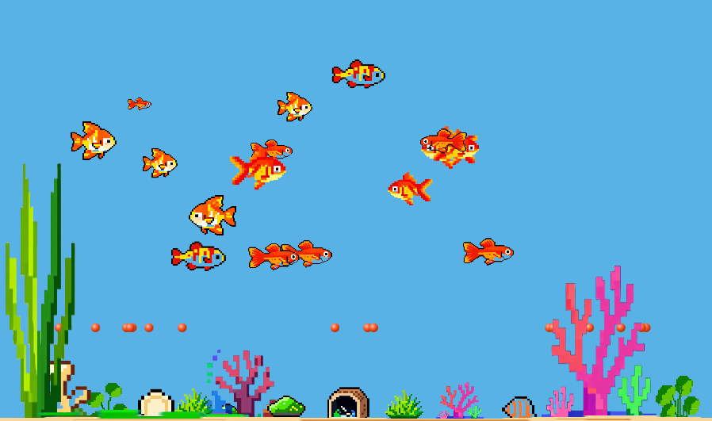

# Deskquarium 🐠

**一个桌面水族箱模拟器** — 在你的电脑桌面上养一缸鱼！


## 简介

Deskquarium 是一款使用 Godot 4.6 引擎开发的桌面水族箱游戏。你可以在桌面上养鱼、喂食、装饰鱼缸，甚至可以把它设置为桌面壁纸，让鱼儿在图标下游动。



## 🎮 功能特性

### 🐟 鱼类系统
- **4 种鱼类**：孔雀鱼（Guppy）、金鱼（Goldfish）、神仙鱼（Angelfish）、龙鱼（Arowana）
- 每种鱼有独特的**成长等级**（最高 5~15 级不等）
- 鱼类有**饥饿值**系统，需要定时投喂
- 鱼类具有空闲**游动 AI**，并会自主寻找食物
- 解锁条件：累计收益达到一定数额可解锁更高级的鱼种

### 🪸 装饰系统
- **18 种装饰物**：水草、珊瑚、莫斯、海螺、贝壳、虾屋等
- 装饰物可以自由**放置**、**拖拽移动**、**缩放**
- 支持**出售**装饰物换取金币

### 🛠️ 设备系统
| 设备 | 功能 | 价格 |
|------|------|------|
| 自动投喂机 | 鱼食不足时自动投放 | 300 |
| 满级自售 | 鱼达到满级时自动出售 | 500 |
| 自动买鱼 | 鱼数量不足时自动购买 | 800 |

### 🖥️ 特殊显示模式

#### 壁纸模式 🖼️
将游戏窗口设置为桌面壁纸，鱼儿在桌面图标**之下**、壁纸之上游动。利用 Windows `SetParent` API 实现。

#### Tiny 模式 📦
将窗口缩小为 400×200 的小窗口，始终置顶显示。支持：
- **拖拽**移动窗口
- **边缘缩放**（8 个方向）
- **右键菜单**退出

### ⏱️ 时间加速
按 `-` / `=` 键可调整游戏速度（0.1× ~ 5×）。

### 💾 存档系统
自动保存（每 60 秒），支持手动重置存档。

## 🚀 快速开始

### 下载与运行
1. 从 [Releases](https://github.com/ZhanXuzhao/Deskquarium/releases) 下载最新版本
2. 运行 `Deskquarium.exe`

### 从源码构建
1. 安装 [Godot 4.6](https://godotengine.org/)
2. 克隆本仓库：
   ```bash
   git clone https://github.com/ZhanXuzhao/deskquarium.git
   ```
3. 在 Godot 中打开项目，点击「运行」即可

## 🎯 操作指南

| 操作 | 说明 |
|------|------|
| 点击**商店**按钮 | 购买鱼、装饰物、设备 |
| 点击**喂食**按钮 | 进入投喂模式，点击鱼缸投放鱼食 |
| 点击**出售**按钮 | 进入出售模式，点击鱼/装饰物出售 |
| 点击**移动**按钮 | 进入移动模式，拖拽调整装饰物位置/大小 |
| 点击**升级**按钮 | 提升鱼缸容量 |
| 点击**壁纸**按钮 | 切换桌面壁纸模式 |
| 点击**Tiny**按钮 | 切换 Tiny 迷你窗口模式 |
| `ESC` 键 | 取消当前操作 / 关闭面板 |
| `-` / `=` 键 | 减速 / 加速游戏 |

## 🏗️ 项目结构

```
deskquarium/
├── assets/               # 游戏资源文件
│   ├── fish/             # 鱼类图片
│   ├── decorations/      # 装饰物图片
│   └── ui/               # UI 图标
├── autoload/             # 自动加载的单例脚本
│   ├── global.gd         # 全局状态管理
│   └── save_manager.gd   # 存档读写管理
├── data/                 # 静态数据配置
│   ├── fish_data.gd      # 鱼类属性数据
│   ├── decoration_data.gd# 装饰物数据
│   └── equipment_data.gd # 设备数据
├── scenes/               # 场景文件
│   ├── aquarium/         # 鱼缸场景
│   ├── fish/             # 鱼类场景
│   ├── food/             # 食物场景
│   └── ui/               # UI 场景（卡片等）
├── scripts/              # 游戏脚本
│   ├── main.gd           # 主游戏逻辑
│   ├── aquarium/         # 鱼缸逻辑
│   ├── fish/             # 鱼类 AI 和属性
│   ├── food/             # 食物逻辑
│   ├── managers/         # 自动化管理器
│   └── ui/               # HUD 和商店面板
├── shaders/              # 着色器
│   └── water_surface.gdshader  # 水面波浪效果
├── main.tscn             # 主场景
└── project.godot         # 项目配置
```

## 🧩 技术栈

- **引擎**：Godot 4.6
- **渲染**：Forward Plus, Direct3D 12
- **物理**：Jolt Physics 3D
- **着色器**：自定义水面波浪效果（CanvasItem Shader）
- **壁纸模式**：Windows Win32 API（`SetParent`）

## 📜 许可

本项目仅供学习与个人使用。
